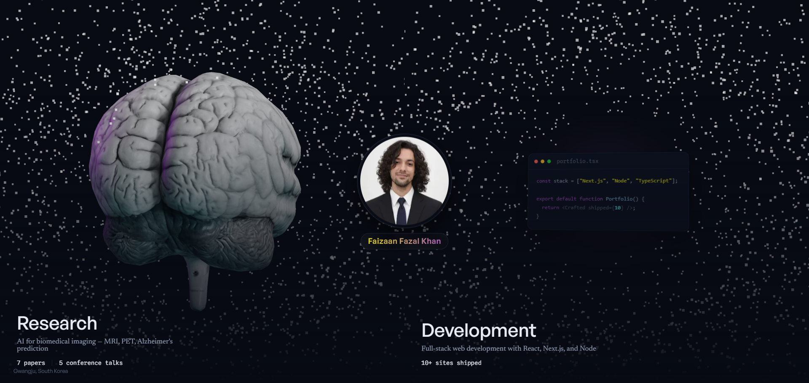

# Faizaan Fazal Khan — Portfolio

A dual-profile portfolio: **Research** (AI for biomedical imaging — MRI/PET, Alzheimer's prediction) and **Development** (full-stack web engineering). Visitors pick a side at `/` and get a tailored home, about, and work section for each — including an interactive 3D brain model with a real-time particle field that reacts to the cursor.



## Stack

- **Next.js 15** (App Router) + **React 19** + **TypeScript**
- [**Once UI**](https://once-ui.com) for the design system
- **three.js** / **@react-three/fiber** for the interactive 3D brain (drag-to-rotate, hover-sway, cursor-dispersing WebGL particles)
- **MDX** (via `next-mdx-remote/rsc`) for blog posts, project case studies, and research publications
- **KaTeX** for math rendering in publications

## Getting started

**1. Clone the repository**
```
git clone https://github.com/FaizaanFazal/Portfolio-Using-Nestjs-OnceUi.git
```

**2. Install dependencies** (Node.js 18.18+, 20+ recommended)
```
npm install
```

**3. Run the dev server**
```
npm run dev
```

**4. Edit content**

Almost all site text lives in structured JSON, not code — edit and reload, no component changes needed:
```
src/content/data/nav.json              # header nav order/icons
src/content/data/footer.json           # footer copyright/attribution
src/content/data/shared/*.json         # person, social links, newsletter, blog meta
src/content/data/dev/*.json            # dev profile: home, about, work, gallery
src/content/data/research/*.json       # research profile: home, about, publications, cv, contact, work
```

**5. Edit site config**
```
src/resources/once-ui.config.ts        # routes, theme, SEO baseURL, social/schema links
```

**6. Add blog posts / projects / publications**
```
src/app/blog/posts/*.mdx               # blog posts
src/app/work/projects/*.mdx            # dev case studies (/dev/work)
src/content/publications/*.mdx         # research papers (/research/publications, /research/work)
```

## CV

The "Download PDF" button on `/research/cv` links directly to `public/assets/cv/Faizaan_Khan_CV_2026.pdf`. Replace that file to update the downloadable CV — the on-page CV content (`src/content/data/research/cv.json`, `src/content/data/research/about.json`) is edited independently.

## Features

- **Dual-profile gate** at `/` — a full-screen chooser between Research and Development, remembering the last choice
- **Interactive 3D brain** — GLB model rendered client-side, click-drag to rotate, sways toward the cursor on hover, with a WebGL particle field that disperses away from the pointer
- **JSON-driven content** — nav, footer, and every page's copy load from `src/content/data/`, so updates don't touch component code
- **MDX content** — publications, case studies, and blog posts, with KaTeX math and syntax-highlighted code
- **SEO** — sitemap, robots.txt, per-page OG image generation, and JSON-LD schema
- **Dark-mode-by-default** theming with a WCAG AA-checked color system
- **Responsive** across desktop, tablet, and mobile

## Built with

This project is built on the [Once UI](https://once-ui.com) **Magic Portfolio** template, licensed under [CC BY-NC 4.0](LICENSE) — attribution required, non-commercial use only. See `LICENSE` for the full terms.
